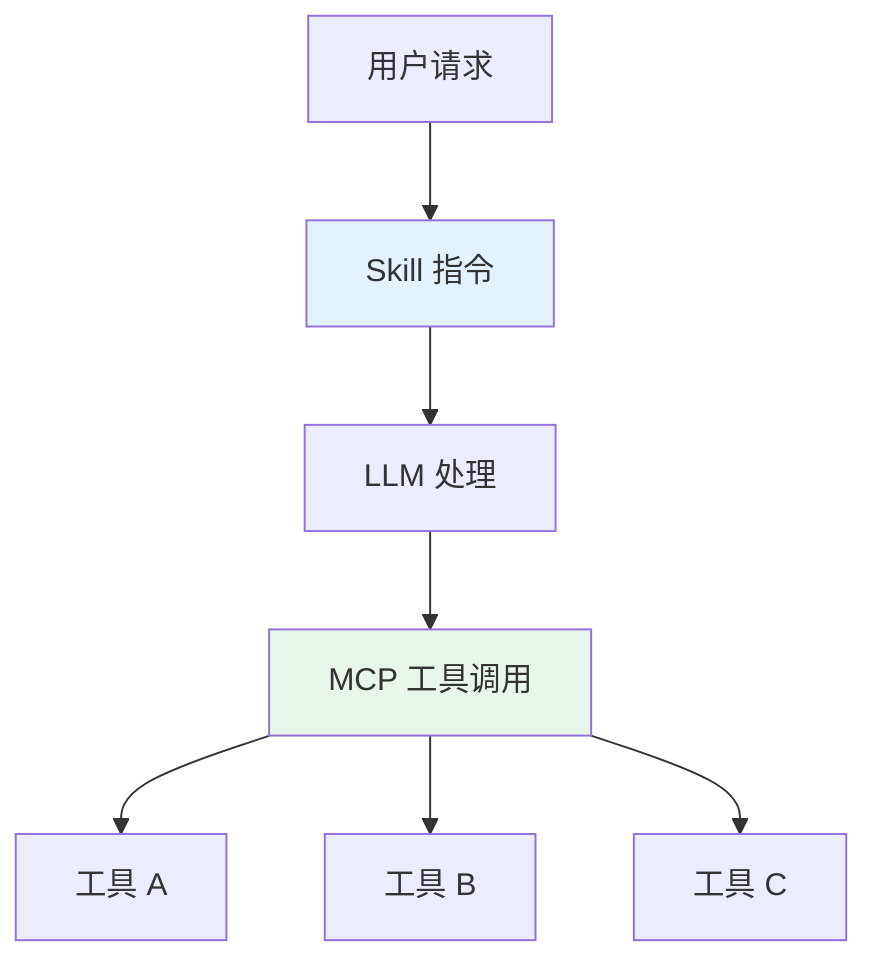
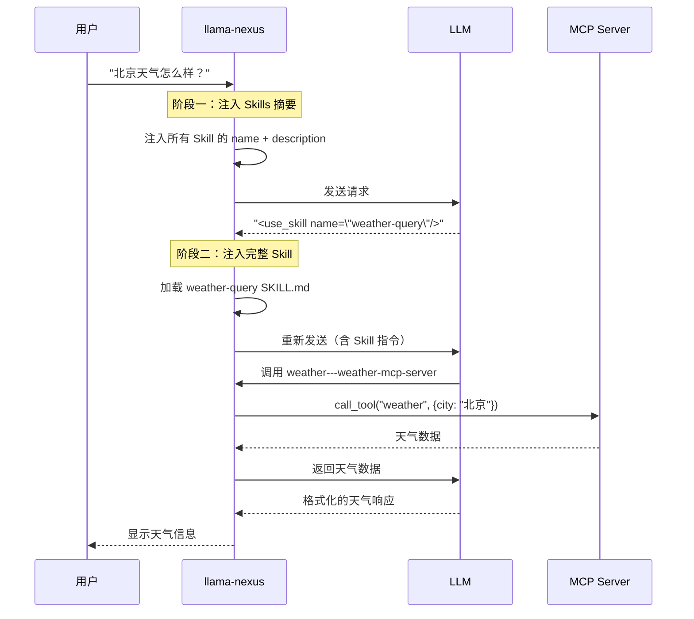

# Skill 开发指南

本文档介绍如何为 llama-nexus 创建自定义 Skills，使 LLM 能够更好地使用您的 MCP 工具。

- [Skill 开发指南](#skill-开发指南)
  - [一、Skills 概述](#一skills-概述)
    - [1.1 什么是 Skill？](#11-什么是-skill)
    - [1.2 Skill vs MCP 工具](#12-skill-vs-mcp-工具)
  - [二、SKILL.md 文件格式](#二skillmd-文件格式)
    - [2.1 基本结构](#21-基本结构)
    - [2.2 元数据字段](#22-元数据字段)
    - [2.3 description 编写指南](#23-description-编写指南)
    - [2.4 allowed-tools 格式](#24-allowed-tools-格式)
  - [三、创建 Skill 示例：天气查询](#三创建-skill-示例天气查询)
    - [3.1 场景](#31-场景)
    - [3.2 创建目录结构](#32-创建目录结构)
    - [3.3 创建 SKILL.md 文件](#33-创建-skillmd-文件)
    - [3.4 配置 MCP Server](#34-配置-mcp-server)
  - [四、工作原理](#四工作原理)
    - [4.1 触发流程](#41-触发流程)
    - [4.2 两阶段 Prompt 示例](#42-两阶段-prompt-示例)
      - [阶段一：注入 Skills 摘要](#阶段一注入-skills-摘要)
      - [阶段二：注入完整 Skill 内容](#阶段二注入完整-skill-内容)
    - [4.3 两阶段加载的优势](#43-两阶段加载的优势)
  - [五、更多示例](#五更多示例)
    - [5.1 代码审查 Skill](#51-代码审查-skill)
    - [5.2 数据库查询 Skill](#52-数据库查询-skill)
  - [六、最佳实践](#六最佳实践)
    - [6.1 Skill 设计原则](#61-skill-设计原则)
    - [6.2 文件组织](#62-文件组织)
    - [6.3 测试 Skill](#63-测试-skill)
  - [七、故障排除](#七故障排除)
    - [7.1 Skill 未被触发](#71-skill-未被触发)
    - [7.2 MCP 工具调用失败](#72-mcp-工具调用失败)
    - [7.3 输出格式不正确](#73-输出格式不正确)

## 一、Skills 概述

### 1.1 什么是 Skill？

Skill 是一个 SKILL.md 文件，包含指导 LLM 完成特定任务的提示词指令。它告诉 LLM：

- **何时使用**：通过 `description` 字段进行语义匹配
- **如何使用工具**：提供具体的工作流程
- **输出格式**：定义期望的响应格式
- **示例**：展示预期的交互方式

### 1.2 Skill vs MCP 工具

| 方面 | Skill | MCP 工具 |
|------|-------|----------|
| **作用** | 提供任务指令给 LLM | 执行具体操作 |
| **形式** | SKILL.md 文件 | MCP Server 提供的工具 |
| **触发** | LLM 根据语义自动选择 | LLM 在执行 Skill 时调用 |
| **关系** | 编排层 | 执行层 |



## 二、SKILL.md 文件格式

### 2.1 基本结构

```markdown
---
name: skill-name
description: 清晰的描述，包含触发关键词。
allowed-tools: Tool1 Tool2
model: optional-model-name
---

# Skill 标题

## 说明

具体的逐步指导...

## 示例

<example>
user: 用户输入
assistant: 助手响应
</example>
```

### 2.2 元数据字段

| 字段 | 必填 | 说明 |
|------|------|------|
| `name` | 是 | Skill 唯一标识符，只能包含小写字母、数字、连字符，最多 64 字符 |
| `description` | 是 | 清晰的描述，最多 1024 字符，**用于语义匹配触发** |
| `allowed-tools` | 否 | 限制此 Skill 可用的工具列表（**空格分隔**，符合 Agent Skills 标准） |
| `model` | 否 | 此 Skill 活跃时使用的模型 |

### 2.3 description 编写指南

`description` 是 Skill 触发的**核心字段**。好的描述应回答两个问题：

1. **这个 Skill 做什么？** 列举具体能力
2. **何时使用？** 包含用户会自然说出的触发词

| 质量 | 示例 |
|------|------|
| ❌ 不好 | `description: 帮助处理天气` |
| ✅ 好 | `description: 查询天气信息，获取指定城市的当前天气、天气预报。当用户询问天气、气温、是否下雨、需要带伞等问题时使用。` |

### 2.4 allowed-tools 格式

工具名称格式为 `工具名---MCP服务器名`：

```yaml
allowed-tools: weather---weather-mcp-server forecast---weather-mcp-server
```

如果不指定，Skill 可以使用所有可用工具。

## 三、创建 Skill 示例：天气查询

### 3.1 场景

假设您有一个天气 MCP Server，提供以下工具：

- `weather`：查询当前天气
- `forecast`：查询天气预报

### 3.2 创建目录结构

```bash
mkdir -p skills/weather-query
```

### 3.3 创建 SKILL.md 文件

```markdown
---
name: weather-query
description: 查询天气信息，获取指定城市的当前天气、天气预报。当用户询问天气、气温、是否下雨、需要带伞等问题时使用。
allowed-tools: weather---weather-mcp-server forecast---weather-mcp-server
---

# Weather Query Skill

## 说明

当用户询问天气相关问题时，按照以下流程执行：

### 工作流程

1. **识别城市**：从用户问题中提取城市名称
   - 如果用户未指定城市，询问用户想查询哪个城市的天气
   - 支持中文城市名和英文城市名

2. **调用天气工具**：使用 MCP 工具查询天气
   - `weather---weather-mcp-server`：查询当前天气
   - `forecast---weather-mcp-server`：查询天气预报
   - 传入城市参数

3. **格式化输出**：将天气信息以友好的格式呈现给用户

### 输出格式

## [城市名] 天气

**当前天气**

- 天气状况：[晴/多云/雨等]
- 温度：[温度]°C
- 体感温度：[体感温度]°C
- 湿度：[湿度]%
- 风速：[风速] km/h

**建议**

- [根据天气给出穿衣/出行建议]

### 注意事项

- 如果 MCP 工具调用失败，告知用户并建议稍后重试
- 温度单位默认使用摄氏度
- 对于天气预报，说明是预测数据可能有偏差

## 示例

<example>
user: 北京今天天气怎么样？
assistant: 我来帮你查询北京的天气。

[调用 weather---weather-mcp-server 工具，参数 city="北京"]

## 北京天气

**当前天气**

- 天气状况：晴
- 温度：25°C
- 体感温度：27°C
- 湿度：45%
- 风速：12 km/h

**建议**

- 天气晴朗，适合户外活动
- 紫外线较强，建议做好防晒
</example>

<example>
user: 明天上海会下雨吗？
assistant: 我来查询上海明天的天气预报。

[调用 forecast---weather-mcp-server 工具，参数 city="上海", days=1]

## 上海明日天气预报

**预报信息**

- 天气状况：小雨
- 温度：18-22°C
- 降水概率：75%

**建议**

- 明天有较大概率下雨，建议携带雨具
- 气温适中，可穿薄外套
</example>
```

### 3.4 配置 MCP Server

确保 `config.toml` 中已配置天气 MCP Server：

```toml
[[mcp.server.tool]]
name = "weather-mcp-server"
transport = "sse"
url = "http://localhost:8080/sse"
enable = true
```

## 四、工作原理

### 4.1 触发流程



### 4.2 两阶段 Prompt 示例

以下是完整的 prompt 示例，展示两个阶段发送给 LLM 的内容。

#### 阶段一：注入 Skills 摘要

> **注意**：阶段一的目标是让 LLM 判断是否需要使用 Skill，因此**不需要注入 MCP 工具信息**。
> 工具信息只在 LLM 选择使用 Skill 后（阶段二）才需要注入。

**系统提示词（System Prompt）：**

```text
你是一个智能助手，可以帮助用户完成各种任务。

## 可用 Skills

以下是可用的专业技能。当用户的请求与某个 Skill 的描述匹配时，
你可以通过在响应中使用 `<use_skill name="skill-name"/>` 标签来请求使用该 Skill。

| Skill | 描述 |
|-------|------|
| weather-query | 查询天气信息，获取指定城市的当前天气、天气预报。当用户询问天气、气温、是否下雨、需要带伞等问题时使用。 |
| code-review | 审查代码变更，检查潜在问题和改进建议。当审查代码、检查 PR、或需要代码质量反馈时使用。 |
| commit | 从 git diffs 生成清晰的提交消息，创建规范的 Git 提交。当编写提交消息、创建 commit 时使用。 |

当你决定使用某个 Skill 时，请在响应开头使用标签，例如：
<use_skill name="weather-query"/>
然后系统会加载该 Skill 的完整指令和可用工具供你使用。

如果任务不需要使用任何 Skill，你可以直接回答用户的问题。
```

**用户消息（User Message）：**

```
北京天气怎么样？
```

**LLM 响应：**

```
<use_skill name="weather-query"/>

我需要使用天气查询技能来帮你查询北京的天气。
```

---

#### 阶段二：注入完整 Skill 内容

当系统检测到 `<use_skill name="weather-query"/>` 标签后，会重新构建 prompt。

**系统提示词（System Prompt）：**

```
你是一个智能助手，可以帮助用户完成各种任务。

## 当前任务：weather-query

### Skill 指令

当用户询问天气相关问题时，按照以下流程执行：

#### 工作流程

1. **识别城市**：从用户问题中提取城市名称
   - 如果用户未指定城市，询问用户想查询哪个城市的天气
   - 支持中文城市名和英文城市名

2. **调用天气工具**：使用 MCP 工具查询天气
   - `weather---weather-mcp-server`：查询当前天气
   - `forecast---weather-mcp-server`：查询天气预报
   - 传入城市参数

3. **格式化输出**：将天气信息以友好的格式呈现给用户

#### 输出格式

## [城市名] 天气

**当前天气**

- 天气状况：[晴/多云/雨等]
- 温度：[温度]°C
- 体感温度：[体感温度]°C
- 湿度：[湿度]%
- 风速：[风速] km/h

**建议**

- [根据天气给出穿衣/出行建议]

#### 注意事项

- 如果 MCP 工具调用失败，告知用户并建议稍后重试
- 温度单位默认使用摄氏度

---

请按照上述指令执行任务。

## 可用工具

你可以使用以下 MCP 工具：
- weather---weather-mcp-server: 查询当前天气
- forecast---weather-mcp-server: 查询天气预报
```

**用户消息（User Message）：**

```
北京天气怎么样？
```

**LLM 响应（调用工具）：**

```xml
<thought>用户询问北京的天气，我需要调用天气查询工具获取北京的当前天气信息。</thought>
<action>weather---weather-mcp-server</action>
<action_input>{"city": "北京"}</action_input>
```

**工具返回结果（Observation）：**

```json
{
  "city": "北京",
  "weather": "晴",
  "temperature": 25,
  "feels_like": 27,
  "humidity": 45,
  "wind_speed": 12
}
```

**LLM 最终响应：**

```markdown
## 北京天气

**当前天气**

- 天气状况：晴
- 温度：25°C
- 体感温度：27°C
- 湿度：45%
- 风速：12 km/h

**建议**

- 天气晴朗，适合户外活动
- 紫外线较强，建议做好防晒
```

---

### 4.3 两阶段加载的优势

1. **阶段一**：系统将所有 Skill 的 `name` 和 `description` 注入到提示词中
2. **阶段二**：当 LLM 决定使用某个 Skill 时（通过 `<use_skill>` 标签），系统加载完整内容

这种设计的优势：

| 优势 | 说明 |
|------|------|
| **减少上下文占用** | 只有被选中的 Skill 才会加载完整内容 |
| **提高效率** | 多数请求可能不需要任何 Skill |
| **LLM 自主选择** | LLM 根据语义判断是否需要 Skill |
| **支持多 Skill** | 可以注册大量 Skill 而不会超出上下文限制 |

## 五、更多示例

### 5.1 代码审查 Skill

```markdown
---
name: code-review
description: 审查代码变更，检查潜在问题和改进建议。当审查代码、检查 PR、或需要代码质量反馈时使用。
allowed-tools: Read Grep Bash(git:*)
---

# Code Review Skill

## 说明

当用户请求代码审查时，按照以下流程执行：

### 工作流程

1. **获取变更**：运行 `git diff` 获取待审查的代码变更
2. **阅读上下文**：使用 Read 工具阅读相关文件
3. **分析代码**：检查逻辑、安全、性能等方面
4. **输出报告**：按照指定格式输出审查报告

### 输出格式

## 代码审查报告

### 概述

[变更的简要描述]

### 问题发现

#### 严重问题

- [问题描述]
  - 位置：[文件:行号]
  - 建议：[修复建议]

#### 建议改进

- [改进建议]

### 总结

[整体评价和建议]

## 示例

<example>
user: 帮我审查一下当前的代码变更
assistant: 我来审查当前的代码变更。

[运行 git diff 获取变更]
[使用 Read 工具阅读相关文件]

## 代码审查报告

### 概述

本次变更新增了用户认证功能...
</example>
```

### 5.2 数据库查询 Skill

```markdown
---
name: db-query
description: 查询数据库，执行 SQL 查询，分析数据。当用户需要查询数据、统计分析、或了解数据库内容时使用。
allowed-tools: query---postgres-mcp-server list_tables---postgres-mcp-server
---

# Database Query Skill

## 说明

当用户需要查询数据库时，按照以下流程执行：

### 工作流程

1. **理解需求**：分析用户想要查询的数据
2. **构建查询**：编写安全的 SQL 查询语句
3. **执行查询**：使用数据库工具执行查询
4. **格式化结果**：将结果以表格或摘要形式呈现

### 安全注意事项

- 只执行 SELECT 查询，不执行 INSERT/UPDATE/DELETE
- 对用户输入进行验证，防止 SQL 注入
- 限制返回结果数量，避免大量数据传输

## 示例

<example>
user: 查询最近一周的订单数量
assistant: 我来查询最近一周的订单统计。

[调用 query---postgres-mcp-server 工具]

## 订单统计

| 日期 | 订单数量 |
|------|----------|
| 2025-12-23 | 156 |
| 2025-12-24 | 189 |
| ... | ... |

**总计**：1,234 笔订单
</example>
```

## 六、最佳实践

### 6.1 Skill 设计原则

1. **单一职责**：每个 Skill 专注于一类任务
2. **清晰描述**：description 要包含用户可能说的关键词
3. **详细指导**：提供明确的工作流程和输出格式
4. **丰富示例**：包含多个典型用例的示例

### 6.2 文件组织

```
skills/
├── weather-query/
│   └── SKILL.md
├── code-review/
│   └── SKILL.md
├── db-query/
│   └── SKILL.md
└── doc-gen/
    └── SKILL.md
```

### 6.3 测试 Skill

创建 Skill 后，通过以下方式测试：

1. 重新加载 Skills：调用 `POST /skills/reload`
2. 使用自然语言测试触发
3. 检查 LLM 是否正确使用了 Skill 指令
4. 验证 MCP 工具调用是否正确

## 七、故障排除

### 7.1 Skill 未被触发

**可能原因**：
- `description` 未包含用户使用的关键词
- Skill 文件格式错误

**解决方案**：
- 丰富 `description` 中的触发词
- 检查 YAML front matter 格式

### 7.2 MCP 工具调用失败

**可能原因**：
- `allowed-tools` 中的工具名称错误
- MCP Server 未启动或配置错误

**解决方案**：
- 确认工具名称格式：`工具名---MCP服务器名`
- 检查 `config.toml` 中的 MCP 配置

### 7.3 输出格式不正确

**可能原因**：
- Skill 中的输出格式说明不够清晰
- 示例不够详细

**解决方案**：
- 提供更详细的输出格式模板
- 添加更多示例

---

*文档版本: 1.0*
*创建日期: 2025-12-29*
*适用项目版本: llama-nexus (feat-plan-mode)*
