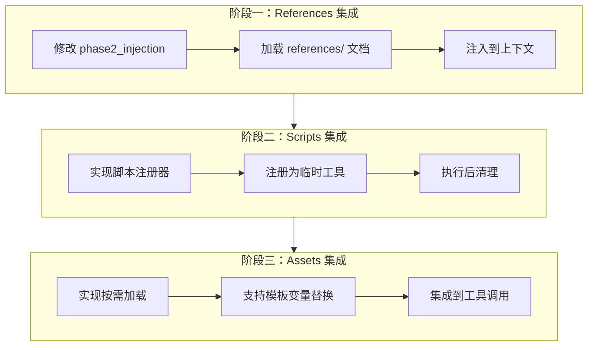
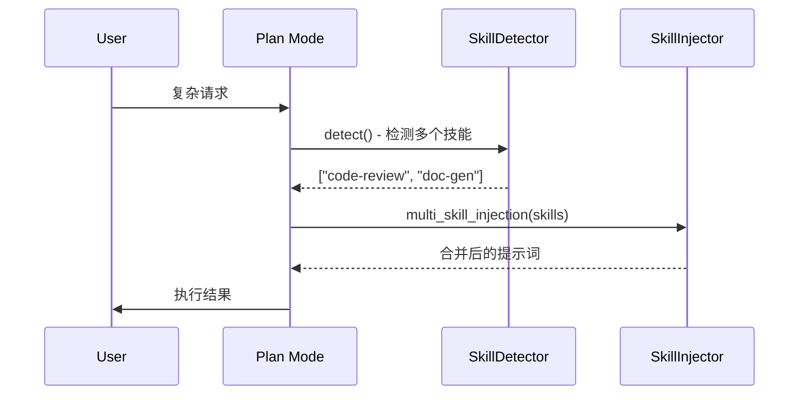
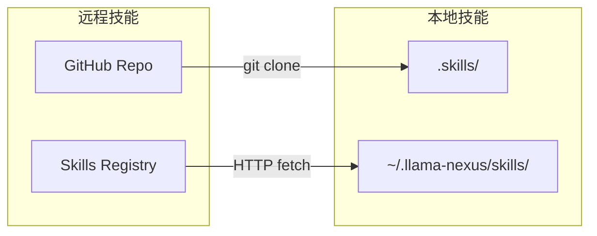

# Skills 功能路线图

本文档记录基于当前 Plan Mode Skills 实现的未来功能规划。

> **当前状态**：Plan Mode 已实现基础 Skills 支持（两阶段加载、工具过滤、执行跟踪）
>
> **参考文档**：
> - [plan-mode-skills-implementation.md](./plan-mode-skills-implementation.md) - 当前实现
> - [skills-architecture.md](./skills-architecture.md) - 架构设计
> - [skill-development-guide.md](./skill-development-guide.md) - 开发指南

- [Skills 功能路线图](#skills-功能路线图)
  - [一、功能概览](#一功能概览)
    - [1.1 当前已实现](#11-当前已实现)
    - [1.2 已预留但未启用](#12-已预留但未启用)
  - [二、资源加载功能](#二资源加载功能)
    - [2.1 功能描述](#21-功能描述)
    - [2.2 预期用途](#22-预期用途)
    - [2.3 实现任务](#23-实现任务)
      - [任务 2.3.1：References 集成](#任务-231references-集成)
      - [任务 2.3.2：Scripts 集成](#任务-232scripts-集成)
      - [任务 2.3.3：Assets 集成](#任务-233assets-集成)
  - [三、多技能支持](#三多技能支持)
    - [3.1 功能描述](#31-功能描述)
    - [3.2 使用场景](#32-使用场景)
    - [3.3 实现方案](#33-实现方案)
    - [3.4 实现任务](#34-实现任务)
      - [任务 3.4.1：多技能检测](#任务-341多技能检测)
      - [任务 3.4.2：多技能注入](#任务-342多技能注入)
      - [任务 3.4.3：执行跟踪](#任务-343执行跟踪)
  - [四、技能管理 API](#四技能管理-api)
    - [4.1 功能描述](#41-功能描述)
    - [4.2 API 设计](#42-api-设计)
    - [4.3 实现任务](#43-实现任务)
      - [任务 4.3.1：API 端点](#任务-431api-端点)
      - [任务 4.3.2：权限控制](#任务-432权限控制)
  - [五、高级特性](#五高级特性)
    - [5.1 技能市场/远程加载](#51-技能市场远程加载)
      - [任务](#任务)
    - [5.2 技能版本管理](#52-技能版本管理)
      - [任务](#任务-1)
    - [5.3 技能依赖](#53-技能依赖)
      - [任务](#任务-2)
    - [5.4 技能模板](#54-技能模板)
      - [任务](#任务-3)
  - [六、优先级矩阵](#六优先级矩阵)
  - [文档版本](#文档版本)

---

## 一、功能概览

### 1.1 当前已实现

| 功能 | 状态 | 位置 |
|------|------|------|
| SKILL.md 解析 | ✅ | `parser.rs` |
| 技能注册表 | ✅ | `registry.rs` |
| 两阶段加载 | ✅ | `plan.rs` |
| 技能检测 (`<use_skill>`) | ✅ | `detector.rs` |
| 提示词注入 | ✅ | `injector.rs` |
| 工具过滤 (`allowed-tools`) | ✅ | `plan.rs` |
| 执行跟踪 | ✅ | `trace.rs` |

### 1.2 已预留但未启用

| 功能 | 状态 | 位置 | 说明 |
|------|------|------|------|
| 资源加载器 | 📦 预留 | `loader.rs` | API 已实现，未集成到执行流程 |
| 多技能注入 | 📦 预留 | `injector.rs` | `multi_skill_injection()` 方法 |
| 技能启用/禁用 | 📦 预留 | `registry.rs` | `set_enabled()` 方法 |
| 技能重载 | 📦 预留 | `registry.rs` | `reload()` / `reload_all()` 方法 |

---

## 二、资源加载功能

### 2.1 功能描述

`SkillLoader` 提供加载技能附加资源的能力，当前已实现 API 但未集成到执行流程。

```
skill-name/
├── SKILL.md           # ✅ 已支持
├── references/        # 📦 待集成
│   ├── api-docs.md
│   └── examples.txt
├── scripts/           # 📦 待集成
│   ├── fetch-data.sh
│   └── process.py
└── assets/            # 📦 待集成
    ├── template.md
    └── config.json
```

### 2.2 预期用途

| 资源目录 | 用途 | 实现方案 |
|----------|------|----------|
| `references/` | 将参考文档注入到上下文，供 LLM 参考 | Phase 2 注入时加载 |
| `scripts/` | 允许 LLM 调用技能定义的脚本工具 | 注册为临时 MCP 工具 |
| `assets/` | 加载模板文件供代码生成使用 | 按需加载到上下文 |

### 2.3 实现任务



#### 任务 2.3.1：References 集成

- [ ] 修改 `SkillInjector::phase2_injection()` 添加 `references` 参数
- [ ] 在 `plan.rs` 中调用 `SkillLoader::load_references()`
- [ ] 将参考文档追加到技能内容后
- [ ] 添加配置项控制最大参考文档大小

#### 任务 2.3.2：Scripts 集成

- [ ] 设计脚本工具注册机制
- [ ] 实现脚本执行沙箱（安全限制）
- [ ] 修改 `get_available_tools()` 支持动态工具
- [ ] 添加脚本执行超时控制

#### 任务 2.3.3：Assets 集成

- [ ] 设计 assets 加载 API
- [ ] 实现模板变量替换功能
- [ ] 添加 `load_asset` 工具供 LLM 调用

---

## 三、多技能支持

### 3.1 功能描述

当前设计仅支持单技能激活。未来可支持同时激活多个技能。

### 3.2 使用场景

```
用户请求：审查代码并生成文档

当前：选择一个技能（code-review 或 doc-gen）
未来：同时激活 code-review + doc-gen
```

### 3.3 实现方案



### 3.4 实现任务

#### 任务 3.4.1：多技能检测

- [ ] 修改 `SkillDetector::detect()` 支持返回多个技能
- [ ] 添加技能优先级/冲突解决机制
- [ ] 更新 `<use_skill>` 标签格式支持多个

#### 任务 3.4.2：多技能注入

- [ ] 启用 `SkillInjector::multi_skill_injection()`
- [ ] 合并多个技能的 `allowed-tools`
- [ ] 处理工具冲突（取交集/并集）

#### 任务 3.4.3：执行跟踪

- [ ] 修改 `SubtaskTrace::active_skill` 为 `Vec<String>`
- [ ] 更新跟踪日志格式

---

## 四、技能管理 API

### 4.1 功能描述

提供 HTTP API 管理技能的启用/禁用/重载。

### 4.2 API 设计

| 端点 | 方法 | 功能 | 状态 |
|------|------|------|------|
| `/api/skills` | GET | 列出所有技能摘要 | 📦 待实现 |
| `/api/skills/{name}` | GET | 获取技能详情 | 📦 待实现 |
| `/api/skills/{name}/enabled` | PUT | 启用/禁用技能 | 📦 待实现 |
| `/api/skills/{name}/reload` | POST | 重载指定技能 | 📦 待实现 |
| `/api/skills/reload` | POST | 重载所有技能 | 📦 待实现 |

### 4.3 实现任务

#### 任务 4.3.1：API 端点

- [ ] 创建 `src/handlers/skills.rs`
- [ ] 实现 CRUD 操作
- [ ] 添加路由配置

#### 任务 4.3.2：权限控制

- [ ] 添加 API 认证（可选）
- [ ] 实现速率限制

---

## 五、高级特性

### 5.1 技能市场/远程加载



#### 任务

- [ ] 设计远程技能协议
- [ ] 实现 `skill install <url>` 命令
- [ ] 添加技能签名验证

### 5.2 技能版本管理

```yaml
# SKILL.md
---
name: code-review
version: 2.0.0
min-agent-version: 0.9.0
---
```

#### 任务

- [ ] 添加 `version` 字段支持
- [ ] 实现版本兼容性检查
- [ ] 支持多版本共存

### 5.3 技能依赖

```yaml
# SKILL.md
---
name: full-review
dependencies:
  - code-review
  - security-scan
---
```

#### 任务

- [ ] 添加 `dependencies` 字段支持
- [ ] 实现依赖解析和加载顺序
- [ ] 处理循环依赖

### 5.4 技能模板

```bash
# 创建新技能
llama-nexus skill new my-skill --template basic
```

#### 任务

- [ ] 设计技能模板格式
- [ ] 实现 CLI 命令 `skill new`
- [ ] 提供内置模板（basic, tool-based, workflow）

---

## 六、优先级矩阵

| 功能 | 优先级 | 复杂度 | 依赖 |
|------|--------|--------|------|
| References 集成 | P1 | 低 | 无 |
| 技能管理 API | P2 | 低 | 无 |
| Scripts 集成 | P2 | 高 | 安全沙箱 |
| 多技能支持 | P3 | 中 | 无 |
| Assets 集成 | P3 | 中 | 无 |
| 远程技能加载 | P4 | 高 | 签名验证 |
| 技能版本管理 | P4 | 中 | 无 |
| 技能依赖 | P4 | 高 | 版本管理 |
| 技能模板 | P4 | 低 | CLI 工具 |

---

## 文档版本

- **版本**: 1.1
- **创建日期**: 2024-12-31
- **更新日期**: 2024-12-31
- **适用项目版本**: llama-nexus (feat-skills)
