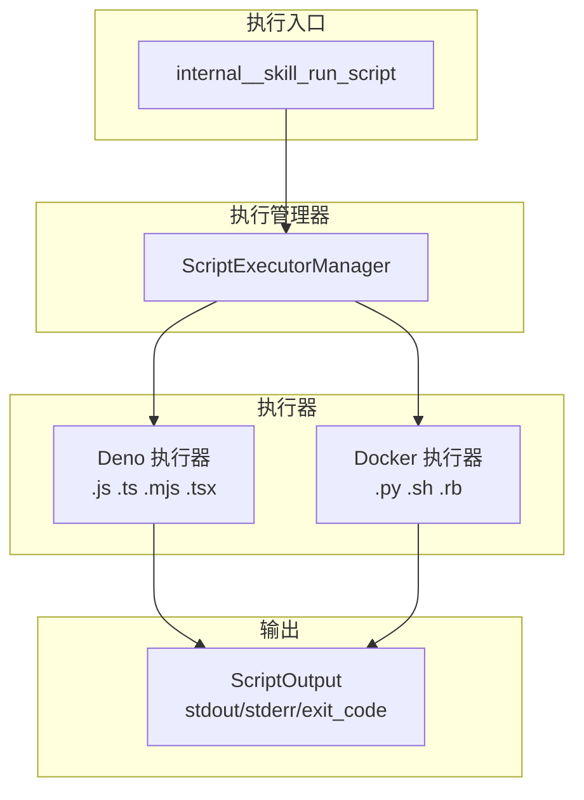
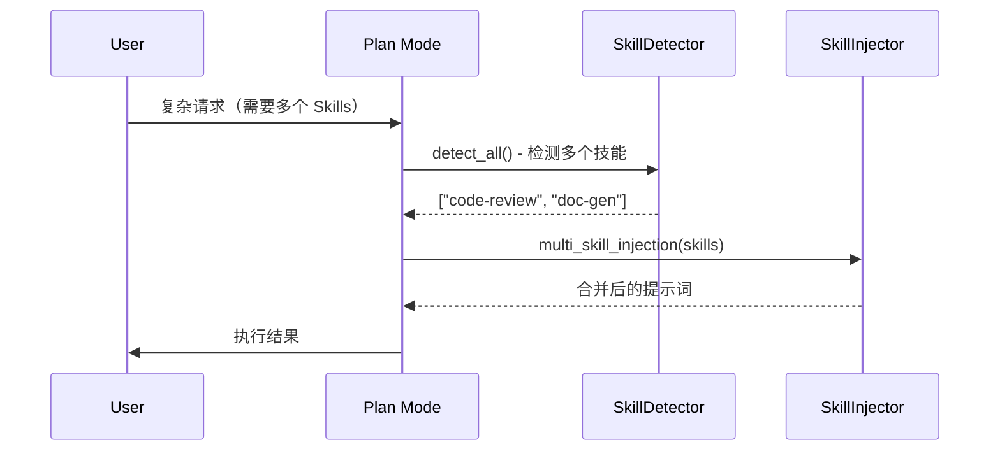
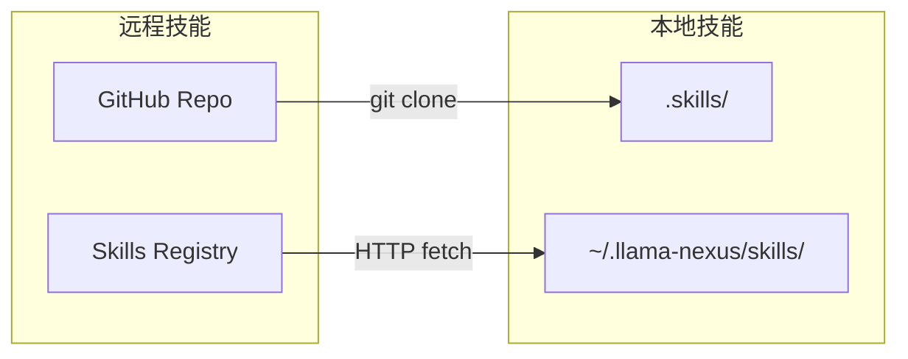

# Skills 功能路线图

本文档记录基于当前 Plan Mode Skills 实现的功能状态和未来规划。

> **当前状态**：Skills 核心功能已完整实现，包括脚本执行、权限控制、资源限制等
>
> **参考文档**：
> - [plan-mode-skills-implementation.md](./plan-mode-skills-implementation.md) - 实现详情
> - [skills-architecture.md](./skills-architecture.md) - 架构设计
> - [skill-development-guide.md](./skill-development-guide.md) - 开发指南

- [Skills 功能路线图](#skills-功能路线图)
  - [一、功能概览](#一功能概览)
    - [1.1 已完成功能](#11-已完成功能)
      - [核心模块](#核心模块)
      - [脚本执行](#脚本执行)
      - [配置系统](#配置系统)
    - [1.2 预留待启用](#12-预留待启用)
    - [1.3 资源加载（已完成）](#13-资源加载已完成)
  - [二、已实现功能详情](#二已实现功能详情)
    - [2.1 脚本执行系统](#21-脚本执行系统)
    - [2.2 资源限制](#22-资源限制)
    - [2.3 权限控制](#23-权限控制)
    - [2.4 文件访问策略](#24-文件访问策略)
  - [三、资源加载功能](#三资源加载功能)
    - [3.1 当前支持](#31-当前支持)
    - [3.2 资源目录（已完成）](#32-资源目录已完成)
    - [3.3 实现任务](#33-实现任务)
      - [任务 3.3.1：References 自动注入 ✅](#任务-331references-自动注入-)
      - [任务 3.3.2：Assets 工具支持 ✅](#任务-332assets-工具支持-)
  - [四、多技能支持](#四多技能支持)
    - [4.1 功能描述](#41-功能描述)
    - [4.2 实现任务](#42-实现任务)
      - [任务 4.2.1：多技能检测 ✅](#任务-421多技能检测-)
      - [任务 4.2.2：多技能注入 ✅](#任务-422多技能注入-)
      - [任务 4.2.3：执行跟踪 ✅](#任务-423执行跟踪-)
      - [任务 4.2.4：多技能同时激活 ✅](#任务-424多技能同时激活-)
  - [五、技能管理 API](#五技能管理-api)
    - [5.1 API 设计](#51-api-设计)
    - [5.2 实现任务](#52-实现任务)
      - [任务 5.2.1：API 端点](#任务-521api-端点)
      - [任务 5.2.2：权限控制](#任务-522权限控制)
  - [六、高级特性](#六高级特性)
    - [6.1 技能市场/远程加载](#61-技能市场远程加载)
    - [6.2 技能版本管理](#62-技能版本管理)
    - [6.3 技能依赖](#63-技能依赖)
    - [6.4 技能模板](#64-技能模板)
  - [七、优先级矩阵](#七优先级矩阵)
    - [核心功能（已完成）](#核心功能已完成)
    - [待实现](#待实现)
    - [高级特性](#高级特性)
  - [文档版本](#文档版本)

---

## 一、功能概览

### 1.1 已完成功能

#### 核心模块

| 功能 | 状态 | 位置 | 说明 |
| ---- | ---- | ---- | ---- |
| SKILL.md 解析 | ✅ 完成 | `parser.rs` | YAML 前置块 + Markdown |
| 技能注册表 | ✅ 完成 | `registry.rs` | 全局单例，支持热重载 |
| 两阶段加载 | ✅ 完成 | `plan.rs` | Phase 1 摘要 + Phase 2 完整内容 |
| 技能检测 | ✅ 完成 | `detector.rs` | `<use_skill>` 标签检测 |
| 提示词注入 | ✅ 完成 | `injector.rs` | 两阶段注入机制 |
| 工具过滤 | ✅ 完成 | `plan.rs` | `allowed-tools` 字段支持 |
| 执行跟踪 | ✅ 完成 | `trace.rs` | 完整执行记录 |
| 字段验证 | ✅ 完成 | `validator.rs` | name/description 格式验证 |

#### 脚本执行

| 功能 | 状态 | 位置 | 说明 |
| ---- | ---- | ---- | ---- |
| Deno 执行器 | ✅ 完成 | `executor/deno.rs` | JS/TS 脚本执行 |
| Docker 执行器 | ✅ 完成 | `executor/docker.rs` | Python/Shell/Ruby 执行 |
| 资源限制 | ✅ 完成 | `executor/types.rs` | 内存/超时/输出限制 |
| 脚本权限控制 | ✅ 完成 | `types.rs` | `allowed-scripts` 字段 |
| 文件访问策略 | ✅ 完成 | `executor/docker.rs` | bind/copy 双模式 |
| 内部工具 | ✅ 完成 | `plan.rs` | `internal__skill_run_script` |

#### 配置系统

| 功能 | 状态 | 位置 | 说明 |
| ---- | ---- | ---- | ---- |
| Skills 配置 | ✅ 完成 | `config.toml` | 目录、启用开关 |
| 执行器配置 | ✅ 完成 | `config.toml` | Deno/Docker 参数 |
| 资源限制配置 | ✅ 完成 | `config.toml` | 全局默认限制 |
| Docker 镜像映射 | ✅ 完成 | `config.toml` | 扩展名→镜像映射 |

### 1.2 预留待启用

| 功能 | 状态 | 位置 | 说明 |
| ---- | ---- | ---- | ---- |
| 多技能注入 | ✅ 完成 | `injector.rs` | `multi_skill_injection()` 方法 |
| 技能启用/禁用 | 📦 预留 | `registry.rs` | `set_enabled()` 方法 |
| 技能重载 | 📦 预留 | `registry.rs` | `reload()` / `reload_all()` 方法 |

### 1.3 资源加载（已完成）

| 功能 | 状态 | 位置 | 说明 |
| ---- | ---- | ---- | ---- |
| References 自动注入 | ✅ 完成 | `injector.rs` | Phase 2 自动加载 `references/` 目录 |
| Assets 工具加载 | ✅ 完成 | `plan.rs` | `internal__skill_load_asset` 工具 |

---

## 二、已实现功能详情

### 2.1 脚本执行系统



**支持的脚本类型**：

| 执行器 | 扩展名 | 运行环境 |
| ------ | ------ | -------- |
| Deno | `.js`, `.ts`, `.mjs`, `.mts`, `.jsx`, `.tsx` | Deno Runtime |
| Docker | `.py` | `python:3.11-slim` |
| Docker | `.sh`, `.bash` | `alpine:latest` |
| Docker | `.rb` | `ruby:3.2-slim` |

### 2.2 资源限制

**三级优先级**（从高到低）：

1. 请求参数中指定的限制
2. Skill 级别的 `execution-limits`（SKILL.md）
3. 全局默认限制（config.toml）

```yaml
# SKILL.md 中的 Skill 级别限制
---
name: my-skill
execution-limits:
  max_memory_bytes: 134217728    # 128MB
  timeout_secs: 30
  max_output_bytes: 524288       # 512KB
  network_access: true
---
```

```toml
# config.toml 中的全局默认限制
[skill.execution.limits]
max_memory_bytes = 268435456    # 256MB
timeout = "30s"
max_output_bytes = 1048576      # 1MB
network_access = false
```

### 2.3 权限控制

**脚本执行权限**（`allowed-scripts` 字段）：

```yaml
allowed-scripts:
  - "*.js"              # 通配符匹配
  - "process.py"        # 精确匹配
  - "data-*.json"       # 前缀匹配
```

**工具访问控制**（`allowed-tools` 字段）：

```yaml
allowed-tools: Read Grep Bash(git:*) mcp__calc__sum
```

### 2.4 文件访问策略

**Docker 执行器的双重策略**：

| 模式 | 说明 | 适用场景 |
| ---- | ---- | -------- |
| `auto` | 优先 bind mount，失败则 copy | 默认，兼容性最好 |
| `bind_only` | 仅 bind mount | 高性能场景 |
| `copy_only` | 仅复制文件到临时目录 | 远程/网络文件系统 |

```toml
[skill.execution.docker]
file_access_mode = "auto"
data_dirs = ["/path/to/skills"]
```

---

## 三、资源加载功能

### 3.1 当前支持

```
skill-name/
├── SKILL.md           # ✅ 完全支持
└── scripts/           # ✅ 完全支持（可执行）
    ├── fetch-data.js
    └── process.py
```

### 3.2 资源目录（已完成）

```
skill-name/
├── references/        # ✅ 已完成自动注入
│   ├── api-docs.md
│   └── examples.txt
└── assets/            # ✅ 已完成工具加载
    ├── template.md
    └── config.json
```

| 资源目录 | 用途 | 当前状态 |
| -------- | ---- | -------- |
| `references/` | 参考文档注入到上下文 | ✅ Phase 2 自动注入 |
| `assets/` | 模板文件按需加载 | ✅ `internal__skill_load_asset` 工具 |

### 3.3 实现任务

#### 任务 3.3.1：References 自动注入 ✅

- [x] 修改 `phase2_injection()` 自动加载 `references/` 内容
- [x] 添加配置项控制最大参考文档大小（`max_reference_size`）
- [x] 支持 `references` 字段指定要加载的文件列表（支持 glob 模式）

**实现细节**：

- `SkillInjector::phase2_injection_auto_refs()` 自动加载并注入参考文档
- `SkillLoader::load_references_with_patterns()` 支持按模式过滤文件
- 配置项 `[skill].max_reference_size` 控制最大加载大小（默认 100KB）
- SKILL.md 中 `references` 字段支持 glob 模式（如 `["*.md", "api-*.txt"]`）

#### 任务 3.3.2：Assets 工具支持 ✅

- [x] 添加 `internal__skill_load_asset` 工具供 LLM 调用
- [x] 实现模板变量替换功能（`{{variable}}` 语法）
- [x] 支持 JSON/YAML/Markdown 格式解析

**实现细节**：

- `internal__skill_load_asset` 内部工具允许 LLM 按需加载技能的 assets/ 文件
- 支持模板变量替换：使用 `{{key}}` 语法，通过 `variables` 参数传入键值对
- 支持三种格式解析：
  - `parse_as: "json"` - 解析并格式化 JSON 内容
  - `parse_as: "yaml"` - 解析并格式化 YAML 内容
  - `parse_as: "markdown"` - 以 Markdown 格式返回内容
- 工具参数：
  - `asset_name`（必需）：assets/ 目录下的文件名
  - `variables`（可选）：模板变量对象
  - `parse_as`（可选）：解析格式

**使用示例**：

```json
{
  "name": "internal__skill_load_asset",
  "arguments": {
    "asset_name": "report-template.md",
    "variables": {"title": "Monthly Report", "date": "2024-01-15"},
    "parse_as": "markdown"
  }
}
```

---

## 四、多技能支持

### 4.1 功能描述

当前设计仅支持单技能激活。未来可支持同时激活多个技能。



### 4.2 实现任务

#### 任务 4.2.1：多技能检测 ✅

- [x] 修改 `SkillDetector::detect()` 支持返回多个技能
- [x] 添加技能优先级/冲突解决机制
- [x] 更新 `<use_skill>` 标签格式支持多个（逗号分隔）

**实现细节**：

- `SkillDetector::detect()` 已支持检测多个技能，包括：
  - 多个 `<use_skill>` 标签：`<use_skill>a</use_skill> <use_skill>b</use_skill>`
  - 逗号分隔格式：`<use_skill>skill-a, skill-b, skill-c</use_skill>`
  - 自动去重：重复的技能名只保留一次
- `SkillMetadata` 通过 `metadata` 字段支持扩展（符合 Agent Skills Standard）：
  - `metadata.priority` - 技能优先级（字符串格式，-100 到 100，默认 0）
  - `metadata.conflicts` - 冲突的技能列表（逗号分隔的字符串）
- 新增优先级解析方法：
  - `SkillMetadata::get_priority()` - 从 metadata 中获取优先级
  - `SkillMetadata::get_conflicts()` - 从 metadata 中获取冲突列表
  - `SkillDetector::resolve_by_priority()` - 按优先级排序技能（高优先级在前）
- 新增冲突检测方法：
  - `SkillDetector::resolve_conflicts()` - 检测并移除冲突的低优先级技能
  - `SkillDetector::detect_and_resolve()` - 一站式方法：检测 + 优先级排序 + 冲突解决

**SKILL.md 配置示例**：

```yaml
---
name: primary-skill
description: High priority skill
metadata:
  priority: "20"
  conflicts: "secondary-skill, legacy-skill"
---
```

#### 任务 4.2.2：多技能注入 ✅

- [x] 启用 `SkillInjector::multi_skill_injection()`
- [x] 合并多个技能的 `allowed-tools`（取并集）
- [x] 合并多个技能的 `allowed-scripts`

**实现细节**：

- `SkillInjector::multi_skill_injection()` 已完全重构，支持多技能合并注入
- 输出格式包含：
  - 技能名称列表头部：`## Active Skills: skill-a, skill-b`
  - 合并权限区块：显示所有技能的 allowed-tools 和 allowed-scripts 并集
  - 各技能内容区块：每个技能单独一个 `### Skill: name` 区块
- 新增合并辅助方法：
  - `SkillInjector::merge_allowed_tools()` - 合并多个技能的 allowed-tools（去重保序）
  - `SkillInjector::merge_allowed_scripts()` - 合并多个技能的 allowed-scripts（去重保序）
- 新增引用支持方法：
  - `SkillInjector::multi_skill_injection_with_refs()` - 带手动引用注入
  - `SkillInjector::multi_skill_injection_auto_refs()` - 自动加载各技能的 references/ 并注入

**多技能注入输出示例**：

```markdown
## Active Skills: code-review, security-scan

### Merged Permissions

**Allowed Tools:** Bash, Read, Grep, WebFetch

**Allowed Scripts:** *.js, *.py, scan-*.sh

---

### Skill: code-review

[code-review 技能的完整内容]

---

### Skill: security-scan

[security-scan 技能的完整内容]

---
```

#### 任务 4.2.3：执行跟踪 ✅

- [x] 修改 `SubtaskTrace::active_skill` 为 `Vec<String>`
  - 重命名为 `active_skills: Vec<String>`
  - 添加 `add_active_skill()` 方法（去重）
  - 添加 `set_active_skills()` 方法（替换）
  - 添加 `has_active_skills()` 和 `get_active_skills()` 辅助方法
- [x] 更新跟踪日志格式
  - 单技能：`skill=name`
  - 多技能：`skills=[name1, name2]`
- [x] 添加多技能跟踪测试（13 个新测试）

#### 任务 4.2.4：多技能同时激活 ✅

> **目标**：在 `plan.rs` 中实现多技能同时激活，完成从检测到执行的完整多技能支持链路。

- [x] 修改 `Plan` 结构中的技能字段
  - 将 `active_skill: Option<LoadedSkill>` 改为 `active_skills: Vec<LoadedSkill>`
  - 更新相关的 getter/setter 方法
- [x] 集成多技能检测
  - 使用 `SkillDetector::detect_and_resolve()` 进行多技能检测与冲突解决
  - 支持逗号分隔的技能激活（如 `<use_skill>code-review, security-scan</use_skill>`）
- [x] 集成多技能注入
  - 使用 `SkillInjector::multi_skill_injection_auto_refs()` 合并多技能内容
  - 正确处理优先级和资源限制
- [x] 使用 `SubtaskTrace` 的多技能跟踪方法
  - `set_active_skills()` - 设置激活的技能列表
  - `has_active_skills()` - 检查是否有激活的技能
  - `get_active_skills()` - 获取激活的技能列表
- [x] 添加集成测试（3 个新测试）
  - `test_integration_multi_skill_context` - 测试多技能上下文构建
  - `test_integration_multi_skill_tool_filtering` - 测试多技能工具过滤（合并 allowed_tools）
  - `test_integration_multi_skill_tracing` - 测试多技能跟踪

**实现细节**：

- `execute_subtask_with_react()` 函数重构：
  - `active_skill: Option<LoadedSkill>` → `active_skills: Vec<LoadedSkill>`
  - 技能检测使用 `SkillDetector::detect_and_resolve()` 进行优先级排序和冲突解决
  - 支持 `<use_skill>skill-a, skill-b</use_skill>` 逗号分隔格式
- `filter_tools_by_skills()` 函数重构：
  - Phase 2 使用 `SkillInjector::merge_allowed_tools()` 合并多技能的 allowed_tools
  - 工具过滤使用合并后的并集
- `build_context_for_react()` 函数重构：
  - Phase 2 使用 `SkillInjector::multi_skill_injection_auto_refs()` 合并多技能内容
  - 系统提示显示 `Active Skills: skill-a, skill-b` 格式
- `SkillRegistry::get_all_loaded()` 新增方法：
  - 返回所有已加载且启用的技能，用于优先级/冲突解决

> **依赖**：任务 4.2.1（多技能检测）、任务 4.2.2（多技能注入）、任务 4.2.3（执行跟踪）

---

## 五、技能管理 API

### 5.1 API 设计

| 端点 | 方法 | 功能 | 状态 |
| ---- | ---- | ---- | ---- |
| `/api/skills` | GET | 列出所有技能摘要 | 📦 待实现 |
| `/api/skills/{name}` | GET | 获取技能详情 | 📦 待实现 |
| `/api/skills/{name}/enabled` | PUT | 启用/禁用技能 | 📦 待实现 |
| `/api/skills/{name}/reload` | POST | 重载指定技能 | 📦 待实现 |
| `/api/skills/reload` | POST | 重载所有技能 | 📦 待实现 |

> **注意**：底层方法 `registry.set_enabled()` 和 `registry.reload()` 已实现

### 5.2 实现任务

#### 任务 5.2.1：API 端点

- [ ] 创建 `src/handlers/skills.rs`
- [ ] 实现 CRUD 操作
- [ ] 添加路由配置到 `main.rs`

#### 任务 5.2.2：权限控制

- [ ] 添加 API 认证（可选）
- [ ] 实现速率限制

---

## 六、高级特性

### 6.1 技能市场/远程加载



**任务**：

- [ ] 设计远程技能协议
- [ ] 实现 `skill install <url>` 命令
- [ ] 添加技能签名验证

### 6.2 技能版本管理

```yaml
# SKILL.md
---
name: code-review
version: 2.0.0
min-agent-version: 0.9.0
---
```

**任务**：

- [ ] 添加 `version` 字段支持
- [ ] 实现版本兼容性检查
- [ ] 支持多版本共存

### 6.3 技能依赖

```yaml
# SKILL.md
---
name: full-review
dependencies:
  - code-review
  - security-scan
---
```

**任务**：

- [ ] 添加 `dependencies` 字段支持
- [ ] 实现依赖解析和加载顺序
- [ ] 处理循环依赖

### 6.4 技能模板

```bash
# 创建新技能
llama-nexus skill new my-skill --template basic
```

**任务**：

- [ ] 设计技能模板格式
- [ ] 实现 CLI 命令 `skill new`
- [ ] 提供内置模板（basic, tool-based, workflow）

---

## 七、优先级矩阵

### 核心功能（已完成）

| 功能 | 优先级 | 复杂度 | 依赖 | 状态 |
| ---- | ------ | ------ | ---- | ---- |
| 两阶段加载 | P0 | 高 | 无 | ✅ 完成 |
| 脚本执行 | P0 | 高 | 执行器 | ✅ 完成 |
| 权限控制 | P0 | 中 | 无 | ✅ 完成 |
| 资源限制 | P0 | 中 | 无 | ✅ 完成 |
| References 自动注入 | P1 | 低 | 无 | ✅ 完成 |
| Assets 工具加载 | P1 | 中 | 无 | ✅ 完成 |

### 待实现

| 功能 | 优先级 | 复杂度 | 依赖 | 状态 |
| ---- | ------ | ------ | ---- | ---- |
| 技能管理 API | P2 | 低 | 无 | 📦 待实现 |
| 多技能检测 | P3 | 中 | 无 | ✅ 完成 |
| 多技能注入 | P3 | 中 | 多技能检测 | ✅ 完成 |
| 多技能同时激活 | P3 | 中 | 多技能检测、多技能注入 | ✅ 完成 |

### 高级特性

| 功能 | 优先级 | 复杂度 | 依赖 | 状态 |
| ---- | ------ | ------ | ---- | ---- |
| 远程技能加载 | P4 | 高 | 签名验证 | 🔮 规划中 |
| 技能版本管理 | P4 | 中 | 无 | 🔮 规划中 |
| 技能依赖 | P4 | 高 | 版本管理 | 🔮 规划中 |
| 技能模板 | P4 | 低 | CLI 工具 | 🔮 规划中 |

---

## 文档版本

- **版本**: 2.1
- **创建日期**: 2024-12-31
- **更新日期**: 2026-01-08
- **适用项目版本**: llama-nexus v0.8.2 (feat-sandbox)
